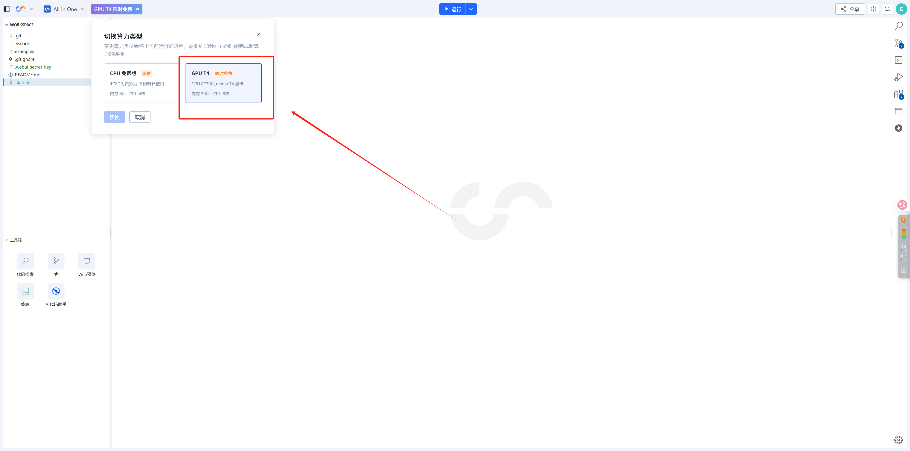
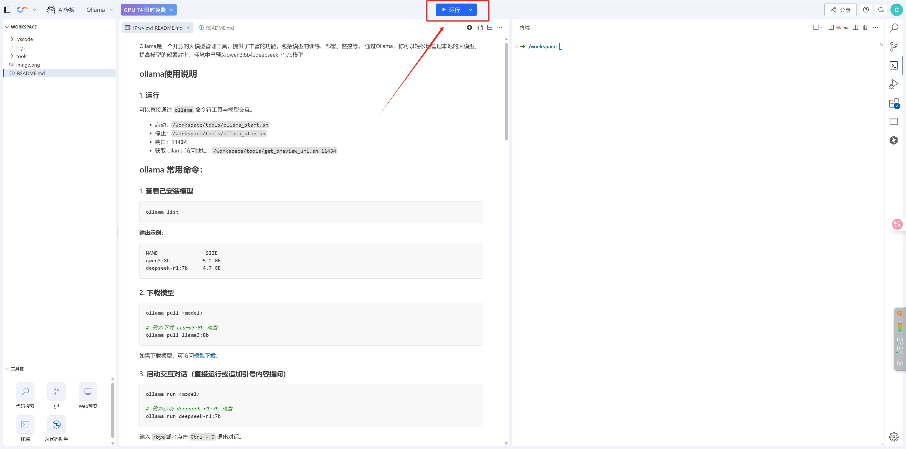
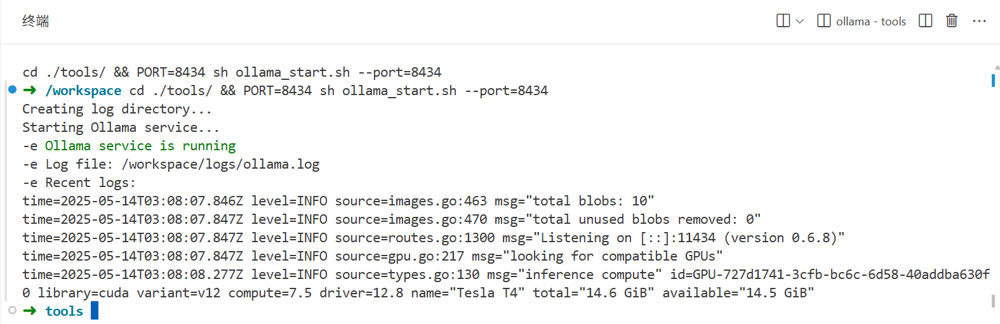

## 概述
本示例内置了 Ollama 推理平台，支持本地运行多种主流开源大语言模型。在 Cloud Studio 中，Ollama 环境已配置完成，用户可直接使用，无需额外安装。

当前已预部署模型包括：
Qwen3:8B：适合中文问答、代码生成等任务
Deepseek-R1:7B：适合代码理解与智能编程助手场景

你可以通过命令行或 OpenAI 接口方式快速加载和使用模型，适合日常测试、原型开发或教学演示。

## 环境配置
- **操作系统**：Ubuntu 24.04
- **Python 版本**：Python 3.11
- **CUDA 版本**：CUDA 12.8
- **模型管理工具**：Ollama 0.6.8
- **模型**：Qwen3:8b、DeepSeek - R1 7B
- **工具**：JupyterLab

## 优先配置

因CPU处理效率低，在这里需切换至GPU可显著提升性能、降低延迟。

</img>

## Ollama 使用说明

### 运行

你可以通过点击 JupyterLab 顶部的 **运行按钮** 快速启动 Ollama服务：



启动成功如下图所示：



### 配置文件

#### preview.yml
项目通过 [preview.yml](.vscode/preview.yml) 文件定义了启动参数、端口号及工作目录等，适用于 Cloud Studio 或本地自动化环境配置。

该文件的内容如下：
```yml
# .vscode/preview.yml
autoOpen: false # 打开工作空间时是否自动开启所有应用的预览
apps:
  - port: 8434 # 应用的端口
    run: sh ollama_start.sh # 应用的启动命令
    root: ./tools/ # 应用的启动目录
    name: ollama # 应用名称
    description: ollama # 应用描述
    autoOpen: true # 打开工作空间时是否自动启动预览（优先级高于根级 autoOpen）
    autoPreview: false # 检测到端口后是否自动查看web预览
```

#### ollama_start.sh
[ollama_start.sh](tools/ollama_start.sh)文件主要是配置了Ollama服务的启动以及日志记录。

该文件的内容如下
```sh
#!/bin/bash

# 颜色定义
GREEN='\033[0;32m'
RED='\033[0;31m'
NC='\033[0m' # No Color

# 日志目录
LOG_DIR="/workspace/logs"
LOG_FILE="$LOG_DIR/ollama.log"

# 创建日志目录
echo "Creating log directory..."
mkdir -p "$LOG_DIR"
if [ ! -d "$LOG_DIR" ]; then
    echo -e "${RED}Failed to create log directory: $LOG_DIR${NC}"
    exit 1
fi

# 设置 Ollama 监听地址
export OLLAMA_HOST=0.0.0.0

# 启动 Ollama 服务
echo "Starting Ollama service..."
nohup ollama serve > "$LOG_FILE" 2>&1 &

# 等待服务启动
sleep 2

# 检查进程是否在运行
if pgrep -x "ollama" > /dev/null; then
    echo -e "${GREEN}Ollama service is running${NC}"
    echo -e "Log file: $LOG_FILE"
    echo -e "Recent logs:"
    tail -n 5 "$LOG_FILE"
else
    echo -e "${RED}Failed to start Ollama service${NC}"
    echo -e "Check logs for details: $LOG_FILE"
    exit 1
fi
```

####  ollama_stop.sh
[ollama_stop.sh](tools/ollama_stop.sh)文件主要是配置了Ollama服务的停止。
```sh
#!/bin/bash

# 颜色定义
GREEN='\033[0;32m'
RED='\033[0;31m'
NC='\033[0m' # No Color

# 检查 ollama 进程
OLLAMA_PID=$(pgrep -x "ollama")

if [ -z "$OLLAMA_PID" ]; then
    echo -e "${RED}Ollama is not running${NC}"
    exit 0
fi

echo "Found Ollama process (PID: $OLLAMA_PID)"
echo "Stopping Ollama service..."

# 尝试正常终止进程
kill $OLLAMA_PID

# 等待进程终止
sleep 2

# 检查进程是否已经停止
if pgrep -x "ollama" > /dev/null; then
    echo -e "${RED}Failed to stop Ollama service gracefully, attempting force stop...${NC}"
    # 强制终止进程
    kill -9 $OLLAMA_PID
    sleep 1
    
    if pgrep -x "ollama" > /dev/null; then
        echo -e "${RED}Failed to stop Ollama service${NC}"
        exit 1
    fi
fi

echo -e "${GREEN}Ollama service has been stopped successfully${NC}"
```

#### get_preview_url.sh
[get_preview_url.sh](tools/get_preview_url.sh)文件主要是配置了Ollama服务的访问地址。
```sh
#!/bin/bash

# Check if port number is provided
if [ $# -ne 1 ]; then
    echo "Usage: get_preview_url.sh <port>"
    echo "Port must be a number between 200 and 20000"
    exit 1
fi

# Check if port is a number
if ! [[ $1 =~ ^[0-9]+$ ]]; then
    echo "Usage: get_preview_url.sh <port>"
    echo "Port must be a number between 200 and 20000"
    exit 1
fi

# Check port range
if [ $1 -lt 200 ] || [ $1 -gt 20000 ]; then
    echo "Usage: get_preview_url.sh <port>"
    echo "Port must be a number between 200 and 20000"
    exit 1
fi

# Check if yaml file exists
if [ ! -f "/var/run/cloudstudio/space.yaml" ]; then
    echo "Configuration file not found"
    exit 1
fi

# Read values from yaml file
spacekey=$(yq -r '.spacekey' "/var/run/cloudstudio/space.yaml")
region=$(yq -r '.region' "/var/run/cloudstudio/space.yaml")
host=$(yq -r '.host' "/var/run/cloudstudio/space.yaml")

# Check if any value is empty
if [ -z "$spacekey" ] || [ -z "$region" ] || [ -z "$host" ]; then
    echo "Failed to read configuration"
    exit 1
fi

# Output URL
echo "https://${spacekey}--$1.${region}.${host}"
```


## 常用命令与操作

### 1. 服务管理
可以直接通过 `ollama` 命令行工具与模型交互，**端口号为11434**。  

#### 1.1. 停止服务
要停止 Ollama 服务，可执行[ollama_stop.sh](tools/ollama_stop.sh)脚本命令 `/workspace/tools/ollama_stop.sh` 。

#### 1.2. 获取访问地址
如果需要获取 Ollama 的访问地址，可执行[get_preview_url.sh](tools/get_preview_url.sh)脚本命令 `/workspace/tools/get_preview_url.sh 11434` 。此命令会根据预设的端口（11434）生成对应的访问链接，你可以将生成的链接复制到浏览器中。


### 2. 模型管理

#### 2.1. 查看已安装模型
使用命令 ollama list ，可以查看当前已安装的模型及其相关信息，如模型名称和占用空间大小。
```bash
ollama list  
```

**输出示例：**  

```
NAME                SIZE   
qwen3:8b           5.2 GB      
deepseek-r1:7b     4.7 GB   
```

#### 2.2. 下载模型

```bash
ollama pull <model>

# 例如下载 llama3:8b 模型
ollama pull llama3:8b
```

如需下载模型，可访问[模型下载](https://ollama.com/models)。

#### 2.3. 启动交互对话（直接运行或追加引号内容提问）
```bash
ollama run <model>

# 例如启动 deepseek-r1:7b 模型
ollama run deepseek-r1:7b
```

输入 `/bye`或者点击 `Ctrl + D` 退出对话。  

**示例对话流程**： 
```
>>> 推荐一个适合初学者的机器学习项目  
<think>
.......
</think>
选择一个适合初学者的机器学习项目是一个循序渐进的过程，以下是为您量身定制的一个项目指南......


>>> 如何评估模型性能？
<think>
.......
</think>
评估机器学习模型性能是确保模型可靠性和有效性的关键步骤。以下是一步步的指南......

>>> /bye  
```


#### 2.4. 查看运行中的模型进程
使用命令 ollama ps ，可以查看当前正在运行的模型进程信息，包括模型名称、ID、占用空间、处理器使用情况以及运行时长等。
```bash
ollama ps
```

**输出示例：**  
```
NAME              ID              SIZE      PROCESSOR    UNTIL              
deepseek-r1:7b    0a8c26691023    6.0 GB    100% GPU     4 minutes from now    
```

> 表示 deepseek-r1:7b 模型正在运行，启动了 4 分钟。


#### 2.5. 停止模型运行
```bash
ollama stop <model>

# 例如停止 deepseek-r1:7b 模型
ollama stop deepseek-r1:7b
```

#### 2.6. 删除模型
```bash
ollama rm <model>

# 例如删除 deepseek-r1:7b 模型
ollama rm deepseek-r1:7b
```

#### 2.7. 帮助文档
```bash
ollama --help
ollama run --help
ollama pull --help
ollama list --help
```


## 相关文档
### Ollama 官网
[Ollama 官网](https://ollama.com/)：在该网站上，你可以获取到关于 Ollama 的介绍、功能说明、可能还有相关的下载信息等。它是了解 Ollama 整体产品情况的重要来源。

### Ollama GitHub 官方仓库
[Ollama Github 官方仓库](https://github.com/ollama/ollama)：在这个仓库中，你能够查看 Ollama 的代码，提交问题报告（issues），了解项目的更新日志，还可以根据仓库中的文档进行安装和使用等操作。

如果你想进一步探索 Ollama 的功能，可以从官网开始了解其特性和使用场景，然后在 GitHub 仓库中查看代码和社区讨论，以便更好地使用和定制 Ollama。


## 帮助和支持
### 欢迎加入Cloud Studio用户反馈群
当您遇到问题需要处理时，您可以直接通过到扫码进入Cloud Studio用户群进行提问.

- 腾讯云工程师实时群内答疑
- 扫码入群可先享受产品上新功能
- 更多精彩活动群内优享

